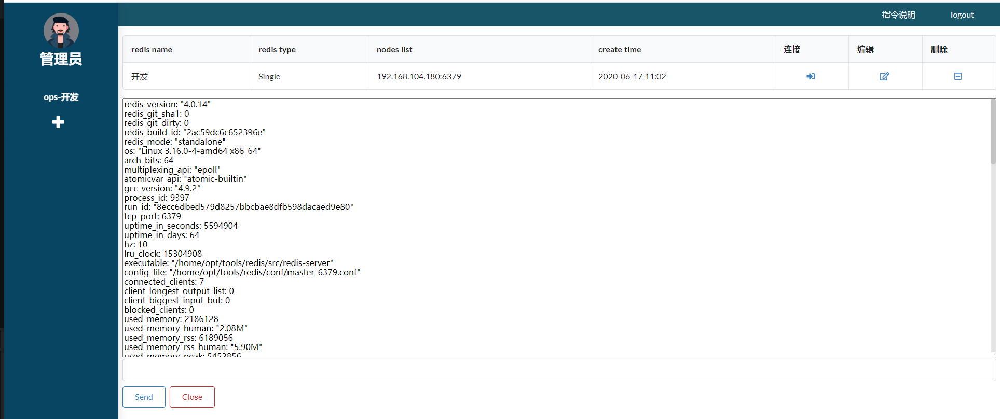

# Redis client for Django

### Requirements
>* channels==2.1.6
>* djangorestframework_simplejwt==4.3.0
>* django-cors-headers==3.2.0
>* djangorestframework==3.5.3
>* django==1.11.7
>* redis-py-cluster==2.0.0
>* redis==3.0.1
>* nuxt.js
>* python==3.6

### Introduction
使用WebSocket于后端的django服务通讯，执行redis指令
前端使用nuxt.js框架，后端使用django,使用websocket进行通讯
后端启动后,需要进入django管理后台，再UserProfile表中添加一个用户，与django auth中的用户关联，不然会提示没有权限登陆

### Redis Command Introduction
指令 | 说明| 实例
-|-|-|
info|打印出redis的信息|info|
get key	|打印string类型的key的value值|get test|
hget name key	|打印hash类型的key的value值|hget domaintoip op.hz.netease.com|
hgetall name|打印出所有的hash类型数据的name的key和value值|hgetall domaintoip|
slowloglen|打印出redis的slow log数量|slowloglen|
slowlog num|打印出redis的slow log信息,num为可选项,如果不输入则打印出所有的slow log|slowlog 或者 slowlog 1|
slowlogrest|清除redis的slow log信息|slowlogrest|
scan key*|打印出匹配key*的string类型key值|scan te*|
hscan name key*|打印出name中配置key*的hash类型key和value数据|hgetall domaintoip www*|
